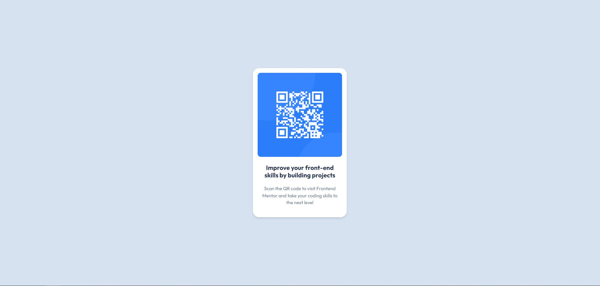

# Frontend Mentor - QR code component solution

This is a solution to the [QR code component challenge on Frontend Mentor](https://www.frontendmentor.io/challenges/qr-code-component-iux_sIO_H). Frontend Mentor challenges help you improve your coding skills by building realistic projects.

## Table of contents

- [Overview](#overview)
  - [Screenshot](#screenshot)
- [My process](#my-process)
  - [Built with](#built-with)
  - [What I learned](#what-i-learned)

## Overview

### Screenshot

## My process

### Built with

- HTML
- CSS
- Flexbox

### What I learned

The design is trivial so I chose this as my first project after learning the fundamentals of HTML and CSS. Making this component helped solidify some of the concepts I've learned about in CSS like fonts, colors and div sizes. I also used flexbox in a very simple way to center the divs.
